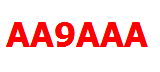



## Image Generator for Motorola XPR series radios

Creates basic images with text for the welcome screen of Motorola XPR series radios.

Currently the mobile XPR5580 have been tested, but it may work for others in the same series.

Example:
Image-Generator -t "AA9AAA" -f Tahoma

Output:\

Description:
Generate an image for a Motorola radio with the given text.

Usage:
Image-Generator [options]

Options:
-?, -h, --help         Show help and usage information\
--version              Show version information\
-t, --text (REQUIRED)  Text to render\
-f, --font             Font name to use [default: Arial]\
-bc, --background      Background color (name, #RRGGBB, #AARRGGBB, or rgb(r,g,b)) [default: Color [White]]\
-tc, --textColor       Text color (name, #RRGGBB, #AARRGGBB, or rgb(r,g,b)) [default: Color [Red]]\
-r, --radio            Type of radio to generate for [default: XPR5580]\
-d, --dir              Output directory to save image to. If it does not exist, it will be created. [default: C:\Image-Generator]